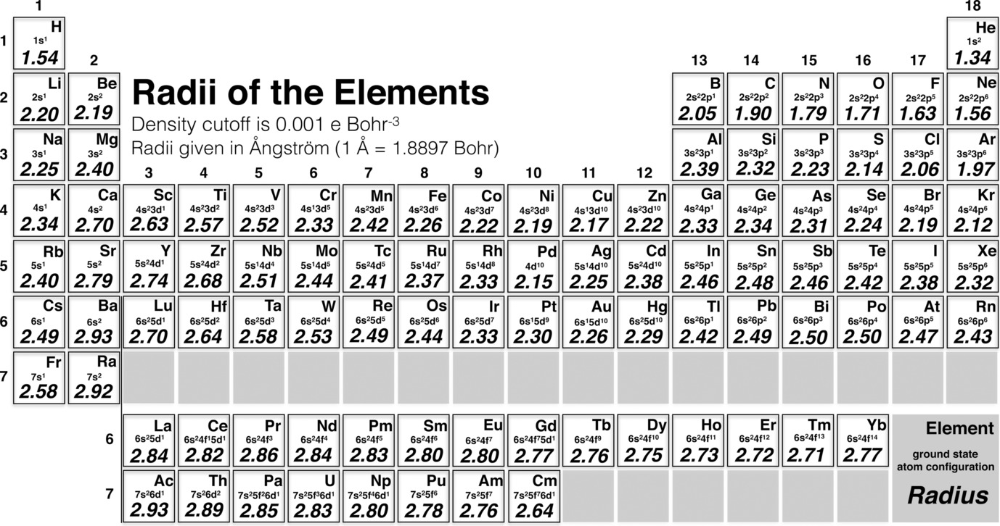

>"If, in some cataclysm, all of scientific knowledge were to be destroyed, and only one sentence passed on to the next generations of creatures, what statement would contain the most information in the fewest words? I believe it is the atomic hypothesis (or the atomic fact, or whatever you wish to call it) that all things are made of atoms—little particles that move around in perpetual motion, attracting each other when they are a little distance apart, but repelling upon being squeezed into one another. In that one sentence, you will see, there is an enormous amount of information about the world, if just a little imagination and thinking are applied."

&nbsp;&nbsp;&nbsp;&nbsp;&nbsp;&nbsp;—[The Feynman Lectures on Physics](https://www.feynmanlectures.caltech.edu/I_01.html)

## Atomic structure

In the world of matter, the atom is a bit of a celebrity. Despite its tiny size, it's the heart and soul of everything we see around us. Let's peel back the layers and see how atoms work.

The atomic nucleus sits center stage, composed of protons and neutrons. If you think of an atom like a tiny city, the nucleus is downtown—where the action is. The number of protons is the atom's ID card, defining its elemental identity. One proton? You've got hydrogen, a rather minimalist element. Ninety-two protons? Meet uranium, a heavyweight champion.

While the nucleus holds the city center, the electrons are the commuters. They dwell in regions around the nucleus called orbitals. But they don't stick to a regular route—thanks to quantum physics, electrons have a flair for unpredictability. They're not orbiting the nucleus in a straightforward path. Instead, they exist in a "cloud" around the nucleus, where we identify their probability of being found.  Electrons are more likely to be found in areas near the nucleus, where they are attracted, and have diminishing probabilities farther away.

But the attraction between electrons and the protons is not the only thing that defines the shape of the electron cloud.  The most essential thing to understand about the electron cloud is that each electron *also* has its own ID card:  its unique combination of quantum numbers. 

Every electron carries a unique set of quantum numbers because they belong to a class of particles known as Fermions. These Fermions abide by a rule known as the **Pauli Exclusion Principle**, a concept conceived by physicist Wolfgang Pauli. His analysis of spectroscopic transitions led him to observe that each electron within an atom seems to inhabit a distinct state. This crucial realization paved the way for Pauli to illuminate the structure of electron shells.

The four quantum numbers are:

**Principal Quantum Number (n):** This is the first quantum number and it indicates the main energy level, or shell, of an electron. It is an integer that takes positive values starting from 1 and increasing. The greater the principal quantum number, the higher the energy level and the further the electron is from the nucleus.

**Azimuthal Quantum Number (l):** This quantum number, also known as the angular momentum quantum number, defines the shape of the orbital where the electron is likely to be found. It can have any integer value from 0 to n-1. For each value of n, there are l orbitals ranging from 0 to n-1. These are often described by letters s, p, d, f, which correspond to shape designations.

**Magnetic Quantum Number (ml):** The magnetic quantum number describes the orientation of the electron's orbital in space. It can have any integer value between -l and +l. For each orbital shape (l), there are 2l + 1 possible orientations.  Thus, s has 1, p has 3, d has 5, f has 7.

**Spin Quantum Number (ms):** The spin quantum number depicts the intrinsic angular momentum, or 'spin' of the electron. Unlike the other three quantum numbers, the spin quantum number can only have one of two values: -1/2 or +1/2, often described as 'spin up' and 'spin down'.

Taken together, these quantum numbers allow us to specify each electron in an atom, including its energy, orbital shape, orbital orientation, and its spin. This understanding forms the basis for much of our understanding of atomic structure and behavior, leading to the prediction of chemical reactions and bonding between atoms.

## Filling atomic orbitals

The process of filling atomic orbitals is a fundamental aspect of atomic structure and it's governed by a set of rules known as the Aufbau Principle, Pauli Exclusion Principle, and Hund's Rule.

Firstly, the **Aufbau Principle** outlines the sequence in which orbitals are filled. "Aufbau" in German translates to "building up", which makes it easier to remember that electrons fill up the lowest energy orbital available first, then move to higher energy orbitals. The order in which they fill is generally 1s, 2s, 2p, 3s, 3p, 4s, 3d, 4p, 5s, and so on.

Secondly, the **Pauli Exclusion Principle** comes into play. As we previously mentioned, this principle states that each electron within an atom must have a unique set of quantum numbers. This means that only two electrons (with opposite spins) can occupy a single orbital, which is fundamentally a region of space around the nucleus of an atom where there is a high probability of finding an electron.

Finally, **Hund's Rule**. When you reach orbitals that have the same energy level (degenerate orbitals), such as the three 2p orbitals or five 3d orbitals, Hund's Rule dictates that each orbital gets one electron before any of them get a second. In other words, electrons prefer to occupy an empty orbital rather than pair up in an already occupied orbital. When they do this, they all have the same spin (usually represented as "up").

So when filling orbitals, we start at the lowest energy level and work our way up, each orbital can take up to two electrons with opposite spins, and when we have a set of equal energy orbitals, each one gets a single electron before any pairing occurs. Understanding these principles helps us predict electron configuration, which is fundamental to understanding chemical behavior.

## Wavefunctions in atoms

Wavefunctions and the Schrödinger equation can seem like a complicated topic, as it seems to involve difficult math and unintuitive concepts.  But let's give it a try.

In the 1920s, observations of how electrons diffract from crystalline solids showed clearly how electrons have both particle-like properties (they travel in a straight line like a classical particle) and wave-like properties (the actual directions they travel can only be explained with the wave concepts of constructive & deconstructive interference.)  This is the "wave-particle duality" or, more succinctly, de Broglie's concept of "matter waves"

To describe these observations, Schrödinger borrowed from the classical wave equation, which describes how sound propagates or how waves travel along a string. These equations relate the second derivatives of the wave's displacement with respect to time ("acceleration") and position ("curvature"), highlighting the relationship between spatial and temporal changes in the wave.  

Similarly, the Schrödinger equation describes the evolution of a wave over time (here, the wave is called the wavefunction). It also involves second derivatives, connecting the temporal change (∂²ψ/∂t²) with the spatial change (∂²ψ/∂x²). However, unlike classical wave equations, the Schrödinger equation includes complex numbers and the involvement of the imaginary unit, reflecting the probabilistic nature of quantum mechanics.

Both the classical and quantum mechanical wave equations employ a differential equation.  Those not familiar with this area of mathematics usually get lost here.  But stay with me kids, it's not so bad.  

Differential equations give us a powerful and efficient way to solve certain kinds of problems, especially those related to waves.  Let's say I've got a sine wave that is moving with some velocity.  I immediately know that the wave at a later time will still be a sine wave, just translated by some amount.  What the differential equation says is that the starting wave and final wave must be the the same, just moved by some factor.  Thus, a differential equation is going to have an equation for the wave on both the left hand side AND the right hand side, as in the Schroding equation:

HY = EY.

In effect, this way of writing the equation places a constraint:  not every Y that I can envision will actually solve this equation properly.  Only those Y that, after multiplying by H, give me Y again (scaled by some factor E) will be valid solutions.

Oh, and what's H?  It's the Hamiltonian.  It provides the kinetic and potential energy of the system.  For example, to get the kinetic energy, the Hamiltonian tells us to take the second derivative of the wavefunction.  Or, to get the potential energy, we determine how far the electron is from the nucleus.  So the Hamiltonian captures some of the key physics.  When the Hamlitonian operates on the wavefunction, we get the total energy of the system, along with the Y.

So, to summarize, the beauty of wave equations like the Schrodinger equation is that some of the most fundamental characteristics of waves--namely, their repeating, oscillatory behavior--is embedded into the basic form of the equation itself.  And their utility comes from their mathematical efficiency.  They allow us to calculate all possible wavefunctions and energies that are valid for a given electron within a given atom.

The differential equation is built to contain all of the relevant physical laws that describe how the wave can change.  Then, all I do is introduce a new wave (or wavefunction) and use the physical laws to calculate the result.  This result might describe the energy of the wavefunction.

OK, fine, so thish sounds a lot like ordinary algebra.  So why do we need the differential equation stuff?  Because when you calculate the result, it not only returns the energy of the wavefunction, it also gives you the wavefunction itself.  The value is this:  the need for the calculation to return the wavefunction itself places a constraint on valid solutions to the wavefunction.  In other words, not every wavefunction is a valid solution to the Schrodinger equation.  Only those with , and get my result.  Interestingly, as these things work, the result **includes** the same wavefunction as the starting wavefunction.  In other words, the calculation returns  

Say I want to know how a wave evolves with time.  Well, I first need to know the starting wave's position, wavelength, and velocity.  Then, given some amount of elapsed time, I can figure out where the wave will be.  I can imagine solving this with some algebra, but an extremely efficient way to solve this is by (1) describing the starting wave, (2) operating on the starting wave according to some physical laws, and (3) obtaining the final wave.  

The use of differential equations typically causes some pain and agony for those unfamiliar with this area of mathematics.  But it actually isn't too bad.  If you take the time-independent version of the Schrodinger equation, you get:

HY = EY

Often, chemists are a bit perplexed how Y could appear on both sides of the equation.  The secret:  H is actually a placeholder for a more complicated expression.  This expression "operates on" Y; alternatively you can call H an "operator".  Contained in the "H" are instructions about calculating the second derivative of the wavefunction, among other things.

The operator H contains a second order differential equation.  In a simple and unrealistic example, suppose that Y = sin x.  If H is just a second order differential, then HY means we take the derivate of sin x twice.  Doing it once gives us cos x.  Doing a second times gives us (-sin x).  Thus, (- sin x) equals EY.  Since Y = sin x, then E must equal -1.

OK, so the matematics aren't too bad.  But why are we "operating" on the wavefunction with second derivatives.  The reason has to do with the 

Now, don't freak out.  I did mention differential equations, but this is doable.  Stay with me.

The basic  

Schrödinger's strategy was to adapt the wave equation from classical physics to quantum mechanics.  Traditionally, the wave equation is used to describe sound or light waves.  We might think of such a wave as described by

y = sin(x + wt)

where y is the amplitude of the wave, x is the position of the wave, w is the angular frequency and t is the time.  But is this, in fact, a wave?  Well, we can check this out with the wave equation:

∂²y/∂t² = v² ∂²y/∂x²

where v is the wave's velocity.  Now, this wave equation isn't used like the typical equations you're familiar with.  You're not just plugging in values on the right hand side to solve for the left hand side.  Instead, the equation itself defines the physics of how a wave should behave, and what we're interested in is finding values of y that solve the equation. So, 

-w² sin (x + wt) = -v² sin (x + wt)

If the "velocity"

Thus, knowing that waves have these special properties, Schrodinger sought to write an equation that would define a wave for quantum mechanics.  Schrodinger wrote:

Ĥψ = Eψ

## Atomic size

So, let's dive into the world of atoms, the tiny Lego blocks that constitute our universe.  If there was one number you should know about atomic size, it is this:  atoms have a size of 1 Ångstrom, or 10&#8209;10 m.  Often, students have confusion about atomic size in part because there are several common units used to describe atoms besides Ångstroms.  Because of nanoscience, we often see nanometers used, where 1 nm = 10 Å, so that an atom is 0.1 nm in size.  But when you dive into expert literature, you'll see authors prefer either Ångstroms or picometers, where 1 pm = 0.01 Å, so that an atom is 100 pm in size.  I often tell my students to have committed to memory that an atom is 1 Å, since it is so useful for making rough estimates.

For example:  How many atoms are in 1 mL (1 cm3)?  Or how many atoms are on a 1 cm2 surface?  Easy.  108 atoms lined up in a row will measure 1 cm, so 1083 or 1024 will be in 1 mL.  Likewise, there will be 1016 atoms in 1 cm2.  In other words, there's about 1 mol of atoms in 1 mL, as a rather rough approximation.  In fact, you probably know that pure water has a concentration of 55.5 M.  So our estimate is too large by a factor of 18.  A common surface, Si, has 8 × 1014 atoms per cm2, so our estimate is too large by a factor of 12.  For both of these examples, it shows us that our "1 Å" estimate is a little too small.  In fact, you'll find better estimates if you suppose that it is the **radius** that is 1 Å rather than the diameter. Because we doubled atomic size, we have 23 = 8× fewer atoms per unit volume, or 22 = 4× fewer atoms per unit area.  So our estimates of water concentration and silicon surface concentration are now too large by about 4×.  That's pretty good!  We didn't even tailor our estimate based on elemental composition!

Let's do that.  If we start with our assumption of a 1 Å radius, how should we tailor this?

**Neutral, isolated atoms:**  The radius of a single atom that is surrounded by vacuum ranges from 3 Å at the bottom left of the periodic table to 1.3 Å at the top right (helium)[^1].

[^1]: M. Rahm, R. Hoffmann, N. W. Ashcroft, Chem. Eur. J. 2016, 22, 14625.

{ align=left }

It should be noted that although defining radii sizes is extremely useful, it is also arbitrary, since electrons are waves whose density never truly reaches zero, even at large radii.  Therefore, one must impose arbitrary cutoffs to define where the atom "is".  In the example above, the authors defined the radius as the distance where the electron density dropped below an value of 0.007 e- per Å3. The radii given in this table give values similar to a standard "van der Waals", i.e., non-bonded radius.

**Ions:** This is where things get complicated, since atoms can exist in varying oxidation states.  But, in general, rcation < rneutral < ranion since adding electrons (all other things being equal) must make the atom larger. This has been shown rigorously in the same paper[^1]. The paper estimated that an atom gets larger by roughly 0.3 Å for every electron added.  Exactly how much will depend on the classical ideas about *shielding* and *penetrating*: how much do the other electrons in the atom shield the new electron from attraction to the nucleus, and how much does the electron penetrate past the core electrons to be close to the nucleus. If these ideas about shielding and penetrating aren't familiar, do [read a bit more](https://chem.libretexts.org/Bookshelves/Physical_and_Theoretical_Chemistry_Textbook_Maps/Supplemental_Modules_(Physical_and_Theoretical_Chemistry)/Quantum_Mechanics/10%3A_Multi-electron_Atoms/Multi-Electron_Atoms/Penetration_and_Shielding).

**Atoms in real materials:**  The calculations above were only for atoms or ions surrounded by vacuum.  However, when atoms are in the solid state (as liquids or solids), they experience attractive interactions.  All atoms will experience London dispersion forces. More significantly, electrostatic or covalent interactions will greatly reduce the distance between atoms, effectively giving them a smaller apparent radius.  The number and magnitude of these interactions vary greatly from one material to another.  Thus, a F- ion in one material could have a radius that is quite different than in another.  The effect of solid state environment was examined previously[^2] and the expected radius of an ion in a given oxidation state and for a given coordination number can be looked up [here](Effective_ionic_radii.pdf). In addition, data mining has recently led to a [more comprehensive database of ionic radii](https://data.mendeley.com/datasets/sp4c25z8pn/1).[^3] An example of the Shannon and Prewitt effective ionic radii are listed in the table.  Presumably, as F has more neighbors, it is better able to take electrons and its radius increases.

[^2]: Shannon, R. D. & Prewitt, C. T. (1970). Acta Cryst. B26, 1046-1048.
[^3]: Gebhardt, Julian & Rappe, Andrew M. (2019). Mendeley Data, V1, doi: 10.17632/sp4c25z8pn.1

Element | Oxidation state | Coordination number | Effective ionic radius (Å)
---|-----|----|--------
F  | -1  | 2  | 1.285
F  | -1  | 3  | 1.300
F  | -1  | 4  | 1.310
F  | -1  | 6  | 1.330

## Atomic shell structure

One of the most foundational ideas that informs atomic structure is the Pauli ex